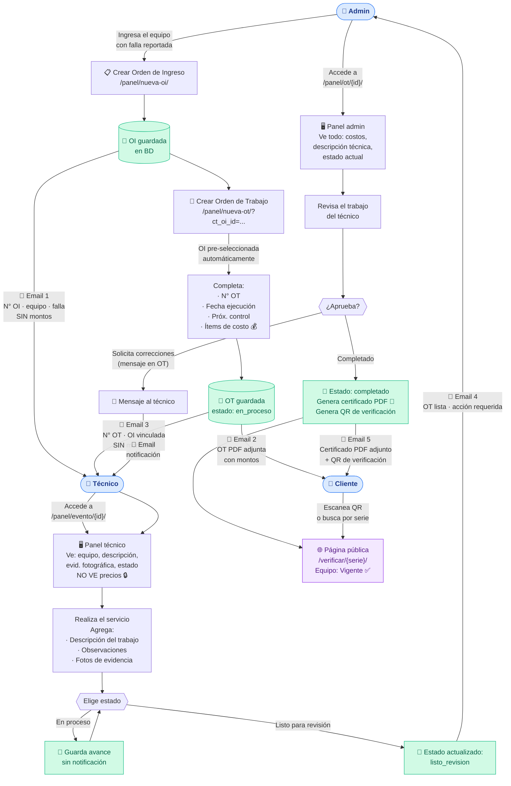

# Flujo del sistema CalibraTrack

## Diagrama de flujo OI → OT → Certificado



---

## Resumen de notificaciones por email

| # | Disparado por | Destinatario | Contenido | Montos |
|---|--------------|-------------|-----------|--------|
| 1 | Admin crea OI | **Técnico** | N° OI, equipo, serie, tipo servicio, falla reportada, link a OI | ❌ No |
| 2 | Admin crea OT | **Cliente** | OT PDF adjunta, detalle del servicio | ✅ Sí |
| 3 | Admin crea OT | **Técnico** | N° OT, OI vinculada, equipo, fechas, falla | ❌ No |
| 4 | Técnico → Listo para revisión | **Admin** | N° OT, técnico, equipo, link para completar | ❌ No |
| 5 | Admin → Completado | **Cliente** | Certificado PDF adjunto, QR verificación | ❌ No |

> **Mensajería interna** (chat en OT): cuando admin o técnico escriben un mensaje en la OT, el otro recibe notificación por email.

---

## Roles y accesos

| Pantalla / URL | Admin | Técnico |
|----------------|-------|---------|
| `/panel/nueva-oi/` | ✅ Crear | ❌ |
| `/panel/oi/{id}/` | ✅ Editar | 👁️ Solo lectura |
| `/panel/nueva-ot/` | ✅ Crear | ❌ |
| `/panel/ot/{id}/` | ✅ Editar completo + precios | ❌ Redirige |
| `/panel/evento/{id}/` | ✅ (redirige a /ot/) | ✅ Editar sin precios |
| `/panel/equipos/` | ✅ | ✅ Solo sus equipos |
| `/panel/eventos/` | ✅ Todos | ✅ Solo sus OTs |
| `/verificar/{serie}/` | 🌐 Público | 🌐 Público |
| `/wp-admin/` | ✅ | ❌ Bloqueado |

---

## Estados de una OT

```
en_proceso → en_ejecucion → listo_revision → completado
   ↑_____________↑_______________↑
         (el técnico puede retroceder)

Solo el ADMIN puede pasar a → completado
```
